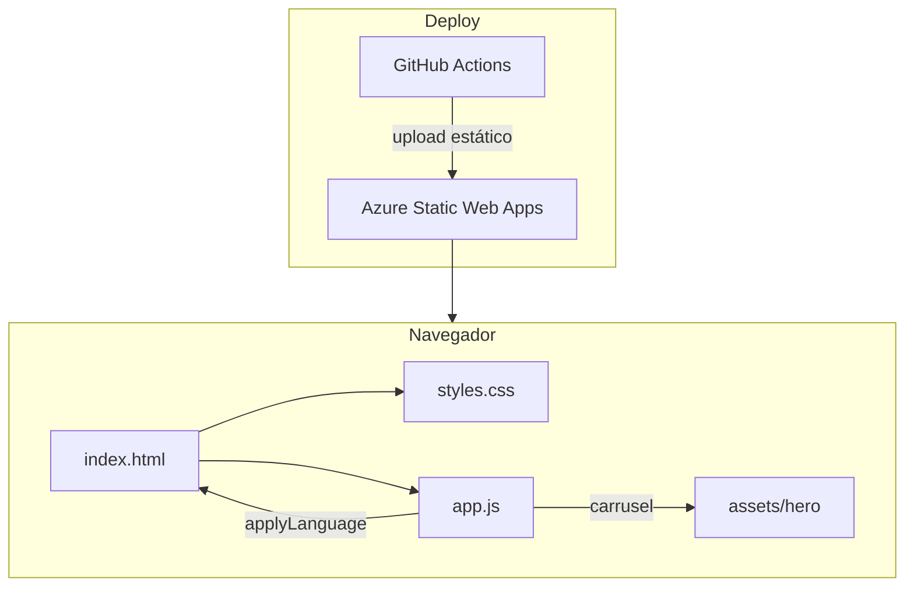

# Arquitectura — FOCO landing

Mapa técnico del sitio estático. Para reglas de producto/copy usá [`AGENT.md`](./AGENT.md). Para voz y mensajes canónicos, [`COPY.md`](./COPY.md).

---

## Resumen

| | |
|---|---|
| Tipo | Landing promocional estática (sin build) |
| Stack | HTML + CSS + JavaScript vanilla |
| Hosting | Azure Static Web Apps |
| CI/CD | GitHub Actions → deploy en push/PR a `main` |
| Idiomas | ES (default) / EN vía `app.js` |

No hay bundler, framework ni backend en el repo. El formulario es front-only hasta conectar email / WhatsApp / CRM.

---

## Árbol del repo

```
marketing-app/
├── index.html          # Marcado semántico + fallback ES (data-i18n)
├── styles.css          # Tokens + layout + bloque CRO v2
├── app.js              # i18n, menú, scroll header, reveal, carrusel, form
├── assets/
│   ├── favicon.svg / favicon-32.png / apple-touch-icon.png
│   └── hero/        # 3 fotos locales del carrusel
├── AGENT.md            # Reglas obligatorias (producto + UI)
├── ARCHITECTURE.md     # Este archivo
├── COPY.md             # Voz, mensajes y CTAs canónicos
├── README.md           # Entrada humana + cómo correr local
└── .github/workflows/  # Azure Static Web Apps
```

---

## Capas



1. **Presentación** — `index.html` + `styles.css`
2. **Comportamiento** — `app.js` (sin módulos ES; un solo archivo)
3. **Contenido i18n** — objeto `translations` en `app.js` (fuente de verdad)
4. **Entrega** — workflow copia la raíz del repo a SWA (`app_location: /`, `output_location: .`)

---

## Responsabilidades por archivo

### `index.html`

- Estructura del funnel (secciones con `id` ancla)
- Fallback en español en nodos `data-i18n` / `data-i18n-placeholder` / `data-i18n-aria`
- Meta SEO, Open Graph, Schema.org
- Header desktop + `#mobile-nav`
- Formulario `#contact-form` + `#form-status`

### `styles.css`

- Tokens en `:root` (`--ink`, `--accent`, `--font-display`, `--hairline`, etc.)
- Layout responsive (móvil → tablet → desktop)
- Header: nav horizontal solo desde **`72rem` (~1152px)**; debajo, menú hamburguesa
- Unidades en `rem` (salvo excepciones documentadas en `AGENT.md`)

### `app.js`

| Bloque | Qué hace |
|--------|----------|
| `translations` | Diccionarios `es` / `en` por clave |
| `applyLanguage(lang)` | Aplica textos a `data-i18n*` y `document.documentElement.lang` |
| Header / menú | Toggle mobile, cierre al navegar, estado `aria-expanded` |
| Scroll | Clase `is-scrolled` en `.site-header` |
| Reveal | `IntersectionObserver` en `.reveal` |
| Form | Validación ligera + mensaje de estado (sin API aún) |
| Carrusel | Rotación de `.hero-slide` (~5,5 s); pausa con `prefers-reduced-motion` |

---

## Funnel (anclas)

| `#id` | Sección |
|-------|---------|
| `#inicio` | Hero |
| `#problemas` | Problemas |
| `#servicios` | Qué hacemos |
| `#casos` | Para tu negocio (rubros) |
| `#proceso` | Cómo trabajamos |
| `#confianza` | Relación |
| `#faq` | Preguntas frecuentes |
| `#contacto` | Contacto |

La nav (desktop y mobile) debe apuntar a los mismos anclas. Si renombrás un `id`, actualizá todos los `href`.

---

## Breakpoints relevantes

| Ancho | Comportamiento típico |
|-------|------------------------|
| ~360px | Móvil: hamburguesa, columnas 1 |
| ~40rem / 48rem | Grillas de contenido (servicios, problemas, etc.) |
| **≤72rem** (incluye tablet y **1024px**) | Header con menú móvil |
| **≥72rem** | Nav horizontal + CTA compacto en header |

Criterio: si el header wrappea o comprime CTAs, no es “listo”. Ver `AGENT.md` §6.

---

## i18n — flujo de datos

1. HTML pinta ES por defecto (accesible sin JS).
2. Al cargar / al clic ES|EN → `applyLanguage`.
3. Solo se actualizan nodos con `data-i18n`, `data-i18n-placeholder` o `data-i18n-aria`.
4. Toda clave nueva debe existir en **es y en** dentro de `translations`.

---

## Deploy

- Trigger: push o PR a `main`
- Acción: `Azure/static-web-apps-deploy@v1`
- Secret: `AZURE_STATIC_WEB_APPS_API_TOKEN_…`
- Sin etapa de build: se publica el contenido tal cual

Dominio canónico / `og:url` / `og:image` deben actualizarse cuando exista dominio definitivo (ver README).

---

## Extensiones previstas (sin implementar aún)

| Cambio | Dónde tocar |
|--------|-------------|
| Envío real del form | `app.js` + endpoint (Azure Function, Formspree, etc.) o deep-link WhatsApp |
| Más fotos hero | `assets/hero/` + markup de slides + respetar motion |
| Nuevo idioma | `translations` + botón de idioma + `lang` |
| Analytics | snippet en `index.html` (consentimiento si aplica) |

Evitar meter un framework “por si acaso”: la arquitectura actual privilegia velocidad de carga y mantenimiento simple.
